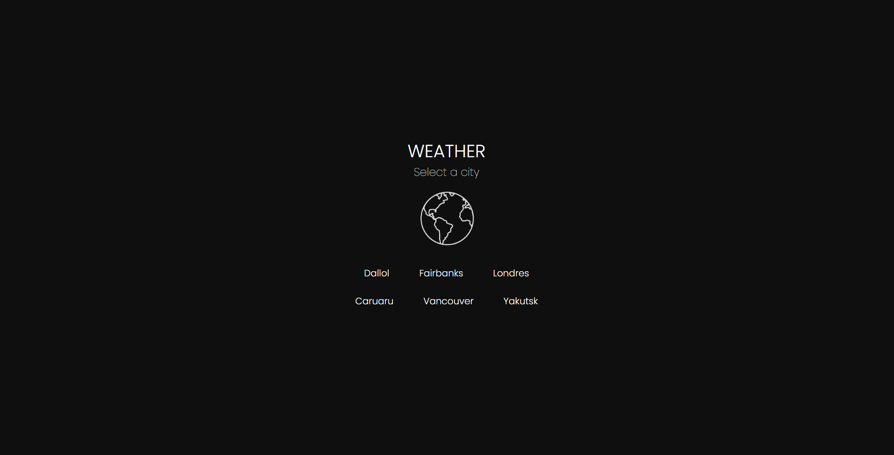
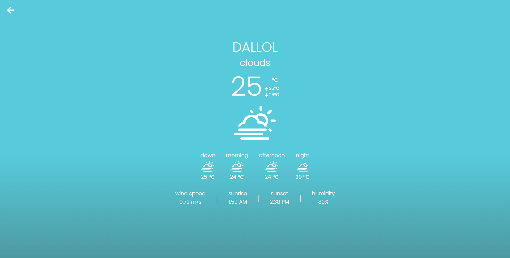

# React Weather App

Projeto desenvolvido com ReactJS





# Instalação

Para utilizar este projeto, abra seu terminal e digite

```bash
npm install
```

ou se preferir, utilize o

```bash
yarn install
```

Após isso, digite

```bash
npm run start
```
```bash
yarn start
```


# Bibliotecas utilizadas

- Typescript (Linguagem)
- [Styled-Components](https://styled-components.com/) (Estilizações)
- [Axios](https://axios-http.com/ptbr/docs/intro) (Requisições api)
- [Bootstrap](https://getbootstrap.com/) (Biblioteca Css)
- [React Router](https://v5.reactrouter.com/web/guides/quick-start) (Rotas)
- [MomentJS](https://momentjs.com/) (Manipulação de data e hora)
- [React Icons](https://react-icons.github.io/react-icons/) (Pacote de ícones)


